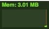

# vue3-memorystats

This Vue 3 Plugin is based on Paul Irish's memory-stats.


## Installation

```
npm install vue3-memorystats
```

## Usage

```
// main.js
import { createApp } from 'vue'
import App from './App.vue'
import vMemoryStats from './js/vMemoryStats'

const app = createApp(App)
app.use(vMemoryStats)
app.mount('#app')
```

## Start Chrome with --enable-precise-memory-info

```
# Linux
google-chrome --enable-precise-memory-info --enable-memory-info

#MacOS
/Applications/Google\ Chrome.app/Contents/MacOS/Google\ Chrome --enable-precise-memory-info --enable-memory-info
```

## Development

```
// install dependencies
npm install
// run example locally and start server
npm run dev
```
